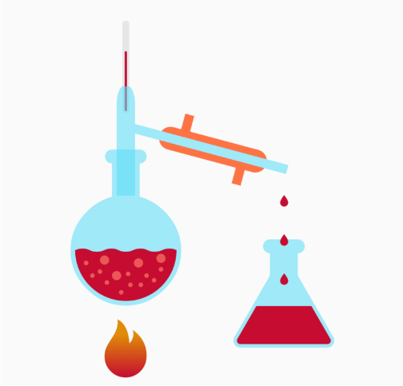

<div align="center">

# Bert Distillation



[](https://www.codefactor.io/repository/github/pussymipt/bert-distillation)


This project is about BERT distillation.

The goal is to distillate any BERT based on any language with convenient high-level API, reproducibility and all new GPU's features.

</div>

### Features
- various losses
- distributed training
- fp16
- logging with tensorboard, wandb etc
- catalyst framework

### A Brief Inquiry


Not so far ago Hugging Face team published [paper](https://arxiv.org/abs/1910.01108) about DistilBERT model. 
The idea is to transfer knowledge from big student model to smaller student model.

First of all we need a well trained teacher model.

Let's take 6 encoders instead of 12! 
We should initialize our small model's layers with teachers layers.

Instead of train our model for a long time on masked language model task we can add to our casual loss KL divergence and cosine loss between student and teacher as we know that a teacher is well trained.

As shown in the paper this method leads to small quality decreasing, reduce model size and speed up inference especially on mobile devices.

### Folders

1. `bin` - bash files for running pipelines
2. `configs` - just place configs here
3. `docker` - project Docker files for pure reproducibility
4. `requirements` - different project python requirements for docker, tests, CI, etc
5. `scripts` - data preprocessing scripts, utils, everything like `python scripts/.py`
6. `src` - model, experiment, etc - research

## Usage
Here is an example for Russian BERT
```
git clone https://github.com/PUSSYMIPT/bert-distillation.git
cd bert-distillation
pip install -r requirements/requirements.txt
bin/download_lenta.sh
python scripts/split_dataset.py --small
catalyst-dl run -C configs/config_ru_ranger.yml --verbose --distributed
```
It will take a lot of time. "Let's go get some drinks"

### Docker

I also add dockerfile.
```
git clone https://github.com/PUSSYMIPT/bert-distillation.git
cd bert-distillation
docker build -f docker/Dockerfile  # yields container id
docker run {your container id}
```


## Contribution

1. Clone repository
2. run `pip install -r requirements/requirements-dev.txt -r requirements/requirements.txt`
3. write some code
4. run `catalyst-make-codestyle`
5. run `catalyst-check-codestyle`
6. if exit code is not 0 refactor your code
7. commit!